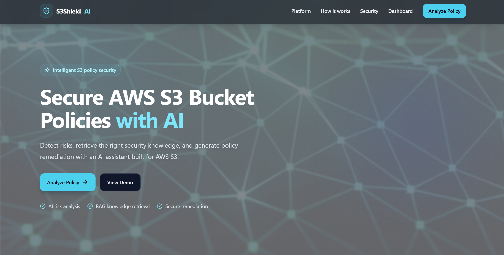
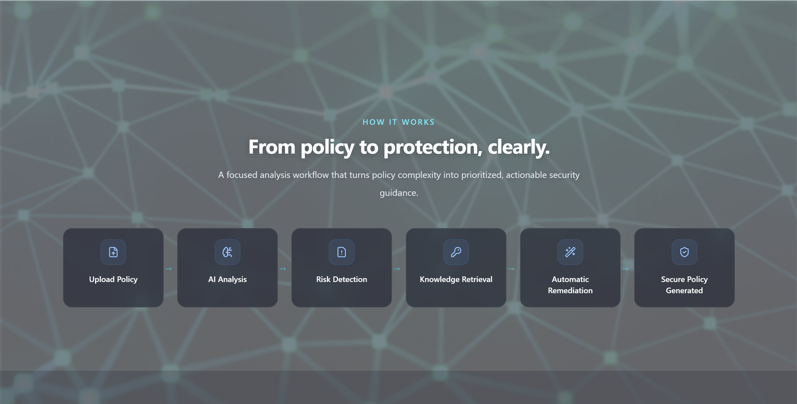
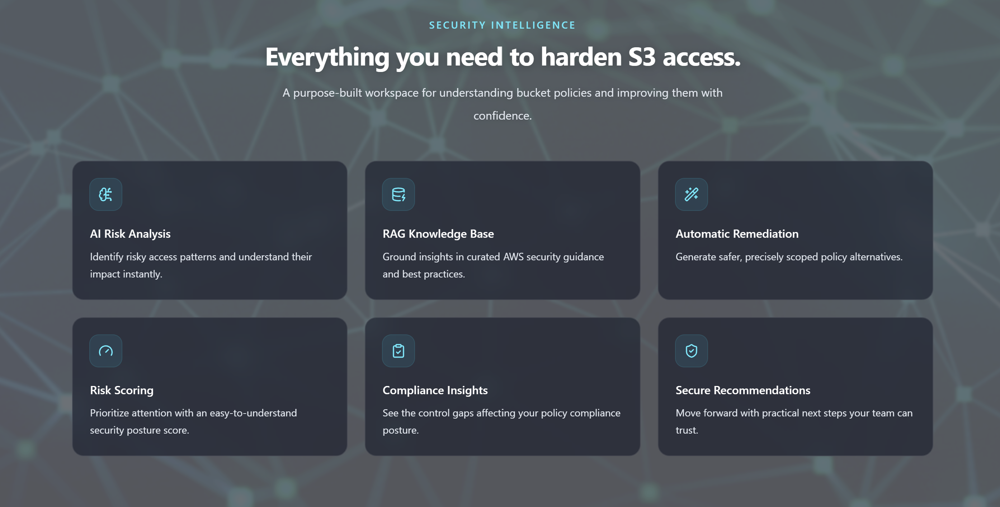
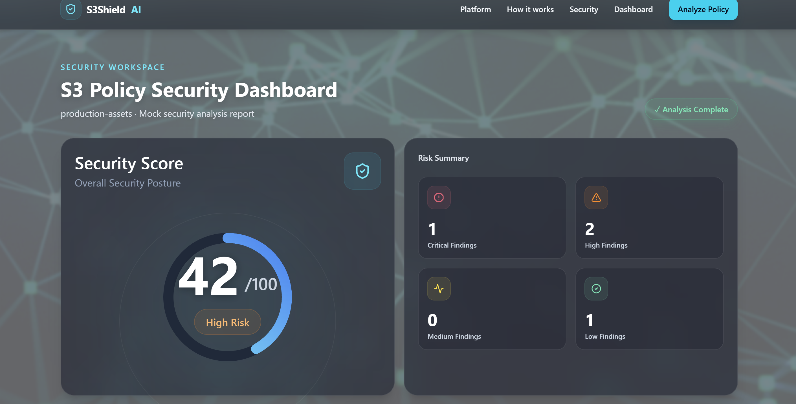
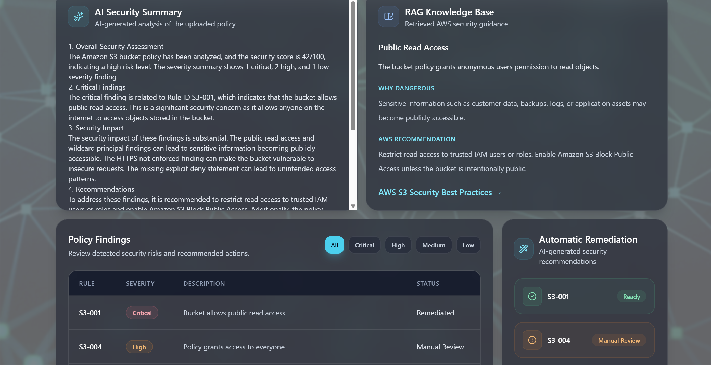
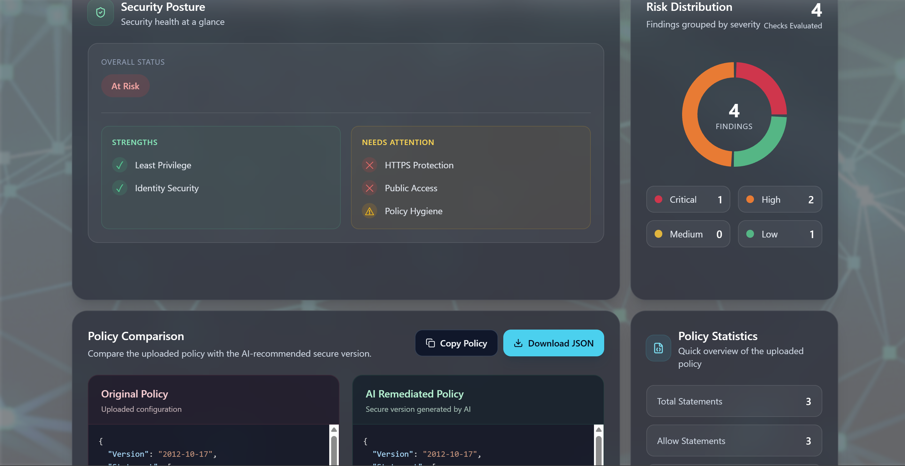

# S3ShieldAI - AI-Powered AWS S3 Bucket Policy Security Analyzer

A full-stack cloud security platform that combines a **deterministic rule engine** with **Retrieval-Augmented Generation (RAG)** to detect S3 bucket policy misconfigurations, explain *why* they're dangerous, and auto-generate a secure, remediated policy — grounded in real AWS documentation instead of raw LLM guesswork.

- **GitHub**: https://github.com/charitha9724/S3ShieldAI

---

## What It Does

Misconfigured S3 bucket policies are one of the most common causes of cloud data breaches, and existing tools (AWS IAM Access Analyzer, Trusted Advisor, open-source scanners) only flag the *what* — not the *why* or *how to fix it*. S3ShieldAI closes that gap:

- **Detects** 13+ security violations in an uploaded bucket policy (public access, wildcard principals/actions/resources, root account access, missing HTTPS enforcement, missing explicit deny, and more) via a deterministic rule engine — no black-box guessing.
- **Scores** the overall security posture with a weighted risk-scoring model and maps it to a clear risk level.
- **Explains** every finding using an LLM (Groq) whose context is grounded in a curated AWS security knowledge base — retrieved semantically via FAISS + Sentence Transformers, not just prompted from memory.
- **Remediates** automatically, generating a corrected, secure version of the uploaded policy.
- **Visualizes** everything — findings, risk score, AI summary, and before/after policy comparison — on a React dashboard.

---

## Architecture

```
User uploads policy (JSON)
         │
         ▼
   React Frontend
         │
         ▼
   FastAPI REST API
         │
         ▼
   Policy Parser (validate + structure)
         │
         ▼
   Rule-Based Security Engine ──► Findings
         │                            │
         ▼                            ▼
   Risk Score Engine          Knowledge Retriever
                                       │
                                       ▼
                              FAISS Vector DB
                          (Sentence Transformers embeddings
                           over curated AWS security docs)
                                       │
                                       ▼
                                  Groq LLM
                          (RAG-grounded explanation)
                                       │
                                       ▼
                         Policy Remediation Engine
                                       │
                                       ▼
                          React Dashboard (results)
```

**Why RAG, not a raw LLM call?** Asking an LLM to explain a security issue from memory alone risks hallucinated or outdated AWS guidance. S3ShieldAI retrieves the most relevant AWS security documentation via semantic similarity search *before* generating a response, so every explanation and recommendation is grounded in real, curated reference material.

---

## Tech Stack

**Frontend**: React · TypeScript · Vite
**Backend**: Python · FastAPI · Uvicorn
**AI / RAG**: Groq LLM · Sentence Transformers (`all-MiniLM-L6-v2`) · FAISS
**Security Analysis**: Custom deterministic rule engine for AWS S3 bucket policies
**Deployment**: Docker · Docker Compose
**Docs / Testing**: Swagger / OpenAPI (auto-generated by FastAPI)

---

## Engineering Decisions Worth Noting

**Hybrid detection, not "AI does everything"** — Vulnerability detection is handled by a deterministic rule engine (consistent, auditable, no hallucination risk). The LLM's job is strictly explanation and remediation, and it's grounded via RAG rather than trusted on raw knowledge.

**RAG pipeline** — Detected findings are converted into a semantic query → embedded with Sentence Transformers → matched against a FAISS index of curated AWS security docs (rule description, real-world impact, AWS recommendations, official references) → top matches injected into the LLM prompt as context.

**Loosely coupled by design** — Each stage (Parser → Rule Engine → Risk Engine → Retriever → AI Explainer → Remediation Engine) is an independent module communicating through defined interfaces, so swapping Groq for OpenAI or FAISS for Pinecone wouldn't require touching the rest of the pipeline.

**Weighted risk scoring** — Findings aren't just counted; each is weighted by severity to produce an overall security posture score and risk classification, rather than a flat pass/fail.

**Explainability over black-box output** — Every AI-generated recommendation traces back to a specific retrieved AWS document, keeping the system auditable rather than a opaque LLM wrapper.

---

## Security Rules Detected

| Category | Examples |
|---|---|
| Access Exposure | Public Read Access, Public Write Access |
| Permission Scope | Wildcard Principal, Wildcard Action, Wildcard Resource, Root Account Access |
| Policy Hygiene | Duplicate Statements, Invalid Resource ARN, Deprecated Policy Version |
| Transport & Enforcement | Missing HTTPS Enforcement, Missing Explicit Deny |
| Access Control | Sensitive Actions, Bucket ACL Permissions |

---

## Screenshots

**Landing Page**


**How It Works**


**Feature Overview**


**Security Dashboard — Risk Score & Summary**


**AI Security Summary, RAG Knowledge Base & Findings**


**Security Posture, Risk Distribution & Policy Comparison**



---

## Known Simplifications → Production Upgrade Path

| Current (Portfolio) | Production |
|---|---|
| Single-user, no auth | JWT-based auth + multi-user support |
| Local FAISS index | Managed vector DB (Pinecone / hosted FAISS) at scale |
| Groq API key in `.env` | Secrets manager (AWS Secrets Manager / Vault) |
| S3 bucket policies only | Extend to IAM policies, Azure/GCP configs |
| Synchronous analysis | Async job queue for large policy batches |

---

## Running Locally

**Requirements**: Python 3.11+, Node.js 18+, Docker Desktop, Git

```bash
git clone https://github.com/charitha9724/S3ShieldAI.git
cd S3ShieldAI
```

Create `backend/.env`:
```
GROQ_API_KEY=your_groq_api_key
```

**Option 1 — Docker (recommended):**
```bash
docker compose up --build
```

**Option 2 — Manual:**
```bash
# Backend
cd backend
python -m venv venv
.\venv\Scripts\Activate.ps1
pip install -r requirements.txt
uvicorn app.main:app --reload

# Frontend (new terminal)
cd frontend
npm install
npm run dev
```

| Service | URL |
|---|---|
| Frontend | http://localhost:5173 |
| Backend API | http://localhost:8000 |
| Swagger Docs | http://localhost:8000/docs |

---

## API Reference

| Endpoint | Method | Description |
|---|---|---|
| `/upload-policy` | POST | Upload and fully analyze an AWS S3 bucket policy |
| `/` | GET | Application status |
| `/health` | GET | Health check |

Full request/response schemas and a live try-it-out console are available via [Swagger UI](http://localhost:8000/docs) once running locally.
